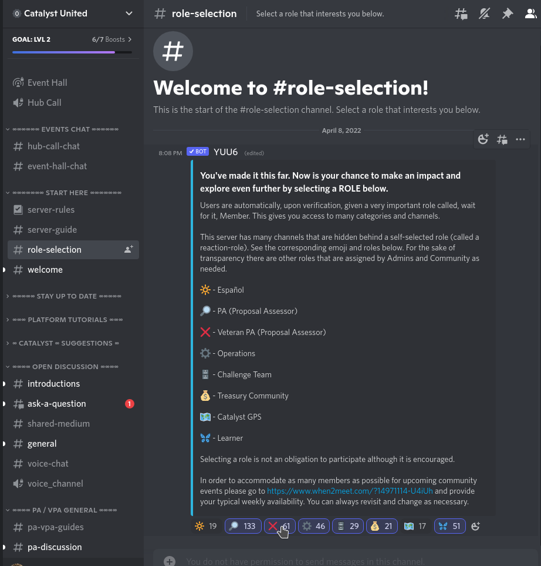

# How to engage & contribute

### On boarding & getting stripes&#x20;

* Jump in the [**Catalyst United Discord**](https://discord.gg/7EsA33kk)&#x20;
* Head over to the [**#role-selection channel**](https://discord.com/channels/946921942143885342/949733050932154398/962051332896874577) **** and select :x:_**Veteran PA (Proposal Assessor)** by clicking the_ :x:emoji below the message. This will enable You to participate in the vPA process WG. You're welcome to choose any other additional roles that interest you.

<figure><figcaption></figcaption></figure>

#### Information Overload?

For better oversight it is possible to **collapse** the **categories**. Only channels with unread messages will stay visible (**bold** & white) when a category is collapsed.\
&#x20;

General **discussions** around the **Veteran PA Working Group** can be found in the channel [**#discussion-vpa-wg** ](https://discord.gg/s2nUyWab)\

### Last step

Familiarise deeply with [Code of Conduct ](code-of-conduct.md#for-the-current-code-of-conduct-coc-please-see-chapter-8.1-in-the-governance-framework-for-pa-v-pa-o)& the [Working Group flow](current-vpa-process-wg-flow.md).

### Start contributing

After you are familiar with the Code of Conduct (CoC) and the workflows you can join the DeWork board [**via this link**](https://app.dework.xyz/catalyst-circle-ca-r/veteran-ca-wg) **** and start writing suggestions and or claiming bounties.

Here's an example of a DeWork task (bounty) opened in Discord 

### Ask (& find guidance)

In case of uncertainty or a feeling of being lost, you can reach out to mods or other veteran PAs in the Discord and please ask away. \
Your inquiries will help to make the on-boarding process more meaningful and engaging!&#x20;
